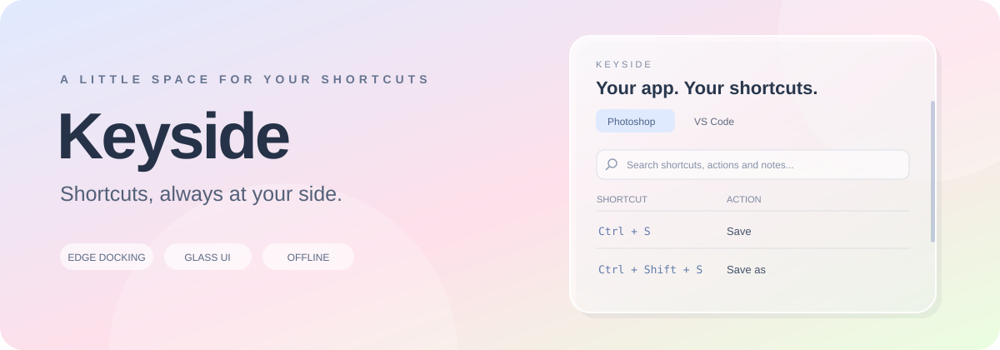
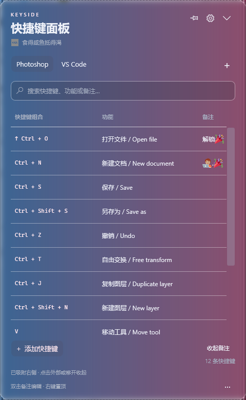
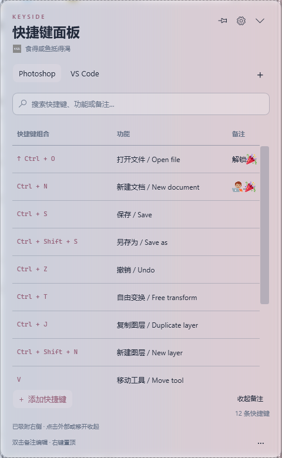
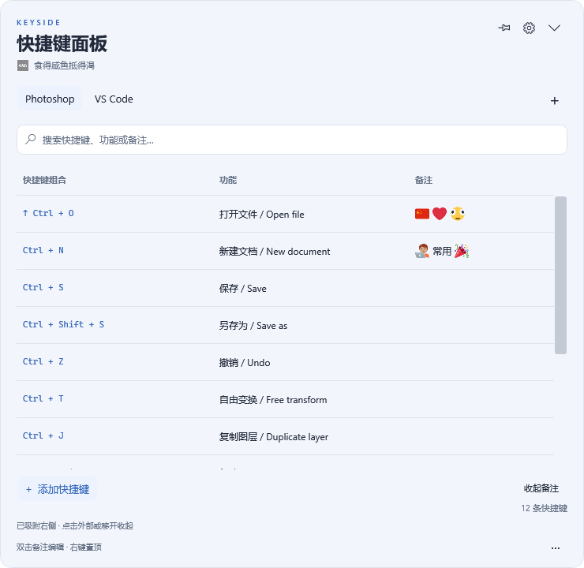
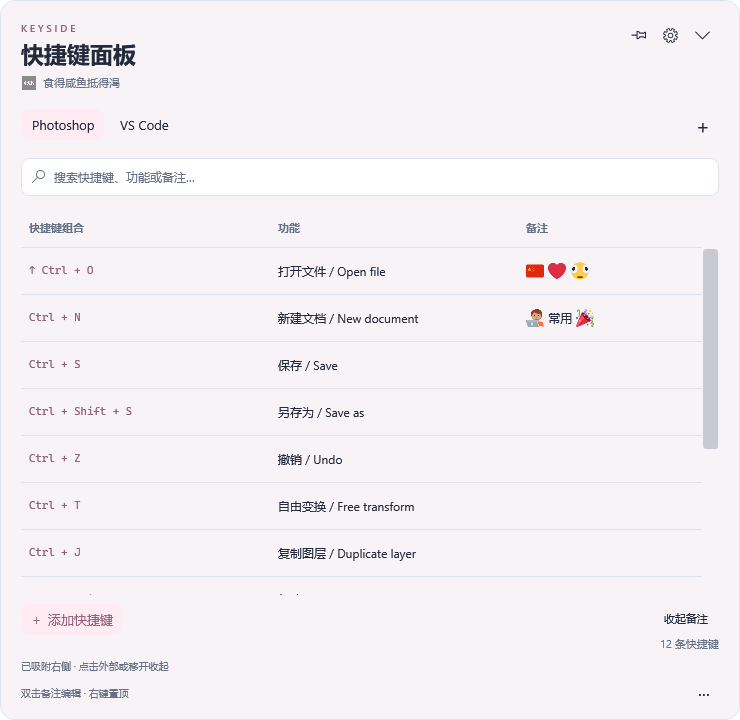
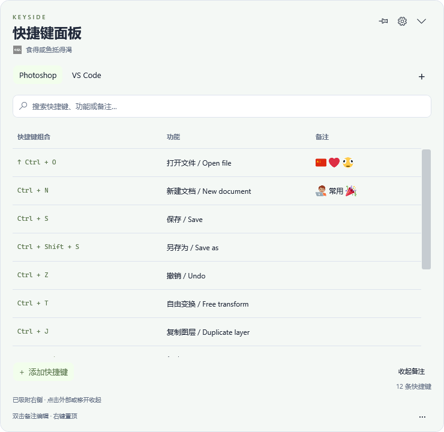

<p align="center"></p>

<p align="center">
  <a href="LICENSE"></a>
  <a href="https://github.com/nengchuanyi-web/Keyside/releases/latest"></a>
  
  
  
</p>

<p align="center"><b>把常用快捷键留在桌面边缘，需要时轻轻移过去。</b></p>
<p align="center">软件标签 · 可调三列 · 彩色 Emoji 备注 · 透明磨砂玻璃</p>
<p align="center">
  <a href="https://github.com/nengchuanyi-web/Keyside/releases/latest"><b>下载 Windows 便携版</b></a> ·
  <a href="docs/USAGE.zh-CN.md">使用说明</a> · <a href="README.en.md">English</a>
</p>

Keyside 是一个 Windows 快捷键查阅与整理面板。拖到屏幕任一边缘即可吸附，鼠标移到细边缘条展开，移开或点击外部自动收起。按软件建立标签页，把组合键、功能和自己的备注放在一起。

> 下载 `Keyside-v0.9.0-win-x64.zip`，**完整解压后双击 `Keyside.exe`**。无需安装，也无需 .NET SDK。

v0.9.0 支持标签页和标签组长按排序：按住约 0.3 秒，拖到左右插入线后松开，顺序自动保存；放在组的中间高亮区域则加入组。组内标签也能排序。更新时先从托盘退出旧版，再解压运行新版；原有分组、快捷键和备注会保留。

## 看起来是什么样

<table>
  <tr><td align="center"><b>深色背景上的玻璃</b></td><td align="center"><b>浅色背景上的玻璃</b></td></tr>
  <tr>
    <td></td>
    <td></td>
  </tr>
</table>

以上为 v0.6 在专用测试背景上的实际窗口截图。**透明度只影响面板背景，文字和 Emoji 保持清晰**；玻璃背景单独模糊，文字根据背景亮度调整对比度。

<details>
<summary>三种柔和配色：淡蓝、浅粉、浅绿</summary>

<table>
  <tr><td align="center">淡蓝 · #E0EAFE</td><td align="center">浅粉 · #FEE0EA</td><td align="center">浅绿 · #EAFEE0</td></tr>
  <tr>
    <td></td>
    <td></td>
    <td></td>
  </tr>
</table>

</details>

## 功能

| | 可以做什么 |
| --- | --- |
| **四边吸附** | 左、右、上、下自动吸附；边缘悬停展开；移开延迟收起，点击外部立即收起；也可自由悬浮。 |
| **按软件整理** | 新建、命名与管理标签页；按组合键、功能或备注搜索；右键将常用条目置顶。 |
| **标签组** | 创建、命名分组；双击进入，返回箭头回到外层；拖入标签，右键移出或解散组；解散保留内容，分组自动保存。 |
| **标签栏排序** | 标签页与标签组可混合排列；长按约 0.3 秒，拖到插入线后松开。组内标签同样可调顺序，重启和备份保留；固定时锁定。 |
| **多选拖动排序** | 点击选中，Shift 连选或 Ctrl 多选；长按约 0.3 秒后整组拖动，按提示线放置并保存顺序。置顶与普通词条分别排序，固定时锁定。 |
| **三列自由调整** | 快捷键组合 / 功能 / 备注的宽度均可拖调；比例自动保存；备注整列可收起、展开。 |
| **Emoji 备注** | 双击空备注添加文本，多行编辑、悬停预览；内置彩色 Emoji 图库，离线支持 Unicode Emoji 17.0。 |
| **外观随你** | 磨砂玻璃、浅色、深色、跟随壁纸亮度；三种柔和主色；背景透明度 0%–65%，整体字号 80%–150%。 |
| **面板缩放与固定** | 四边、四角拖拉尺寸；固定后保持展开并锁定编辑，搜索、切换标签和查看备注仍可用。 |
| **批量导入与备份** | TXT 导入预览、创建标签或追加、自动跳过重复；内置模板下载；JSON 完整备份与恢复。 |
| **中英双语** | 界面可切换中文、English；内置 Photoshop 和 VS Code 示例。 |

这是快捷键参考面板，列表内容用于查阅，不会向其他软件发送组合键。

## 开始使用

1. 从 [Releases](https://github.com/nengchuanyi-web/Keyside/releases/latest) 下载 Windows x64 便携包，完整解压并运行 `Keyside.exe`。
2. 拖动标题栏到屏幕边缘。鼠标移到细边缘条，面板展开；点外部即可收起。
3. 点击 `+` 选择新建软件标签或标签组；双击组进入，将组外标签拖到组上加入。组内的 `+` 直接创建标签。双击词条编辑，右键管理或置顶，设置里调整外观。

图钉固定面板后，底部显示 **“● 已固定 · 保持展开 · 编辑锁定”**。再次点击图钉恢复编辑。退出和重新展开也可通过系统托盘完成。

### TXT 批量导入

右下角 `···` → **导入快捷键 TXT**。每个文件表示一个软件快捷键组，每行格式为：

```text
Ctrl + N@新建文档 / New document
Ctrl + O@打开文件 / Open file
Ctrl + S@保存 / Save
```

推荐 UTF-8；支持 UTF-16 BOM 和 GB18030。预览后可新建标签或追加到已有标签。TXT 导入不包含备注和置顶；完整迁移请用 JSON 备份。菜单中的 **下载模板 TXT 文件** 可保存示例，也可查看 [Template.txt](examples/Template.txt)。

## 系统与数据

- **Windows 10 / 11 x64，.NET Framework 4.8**。便携版无需安装；玻璃画面取样需要 Windows 10 2004 或更新版本，较旧系统使用兼容外观。
- 本地离线运行。数据保存在 `%LOCALAPPDATA%\Keyside`，自动保存并保留上一份有效备份。
- 不采集其他应用按键，不自动安装开机启动项。玻璃模式会在内存中取样面板后方画面，用于绘制背景；不保存取样图片。
- 当前为未签名 MVP，已在 Windows 11 上构建与验证；Windows 10 和多台混合 DPI 显示器仍需进一步实机测试。

详细操作、数据位置、卸载方法和兼容性说明见 [完整使用说明](docs/USAGE.zh-CN.md)。

## 从源码构建

```powershell
powershell.exe -NoProfile -ExecutionPolicy Bypass -File .\build.ps1
```

也可双击 `Build.cmd`。构建后运行 `dist\Keyside.exe` 或 `Start.cmd`。构建使用系统 .NET Framework 编译器，无需 .NET SDK、Node、Python 或 NuGet。

```powershell
# 构建并运行隔离验证；会显示测试窗口
powershell.exe -NoProfile -ExecutionPolicy Bypass -File .\build.ps1 -Verify

# 生成便携包与源码包
powershell.exe -NoProfile -ExecutionPolicy Bypass -File .\package.ps1
```

v0.9.0 的 **455 项检查全部通过**，覆盖混合标签排序、组内顺序、排序线与归组区域区分、保存和旧数据迁移，以及分组导航、拖入 / 移出、多选排序、搜索渲染、固定锁定、吸附、三列拖调、Emoji 与实际玻璃合成。见 [验证记录](docs/verification-v0.9.0.txt)、[架构说明](docs/Architecture.md) 和 [更新日志](CHANGELOG.md)。检查使用隔离数据和本应用控件事件；完整 OLE 拖动手势仍需实机体验确认。

## 致谢与许可

桌面边缘交互参考 [Afterhours](https://github.com/Tokaku7/Afterhours)，玻璃背景分层与项目展示结构参考 [Glance](https://github.com/lulu-loopp/glance)。Keyside 使用独立的 C# / WPF 实现，截图与封面展示本项目。

应用源码采用 [MIT License](LICENSE)。Emoji 图形来自 [Twemoji 17.0.3](https://github.com/jdecked/twemoji/tree/v17.0.3)，采用 CC BY 4.0；Unicode 数据采用 Unicode License v3。第三方素材与商标仍适用各自权利和许可，详见 [THIRD-PARTY-NOTICES.md](THIRD-PARTY-NOTICES.md)。
