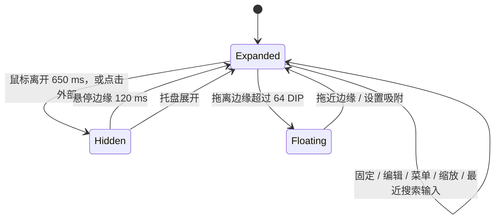

# MVP 架构

**C# 5 + WPF + .NET Framework 4.8 + Win32，Windows x64，完全本地运行。** 当前环境只有 .NET 运行时，没有 .NET SDK；用系统现有 C# 编译器即可产生独立 EXE。

| 模块 | 职责 |
| --- | --- |
| `Program.cs` | STA 启动、单实例、异常日志、验证入口 |
| `Models.cs` | 软件标签页、三列快捷键、逐条置顶、配色设置、输入验证、原子保存和备份恢复 |
| `MainWindow.cs` | 列表、搜索、标签管理、固定编辑锁定、托盘、导入/导出和语言刷新 |
| `Dialogs.cs` | 命名、快捷键编辑、组合键录入和设置；编辑期间阻止收起 |
| `FeatureDialogs.cs` | 备注编辑与彩色预览、TXT 导入预览和目标选择 |
| `EmojiText.cs` | 内嵌 PNG 图库、Unicode 序列 trie、最长匹配、彩色文字混排 |
| `Presentation.cs` | 三色配色 / 旧色迁移、全局字号动态资源 / 最低高度、内嵌图标 |
| `TextImport.cs` | TXT 编码检测、按行解析、错误定位、去重追加、容量检查和 UTF-8 模板保存 |
| `EdgeController.cs` | 与 UI 分离的状态机、物理坐标布局、屏幕工作区、独立触发窗、拖动吸附 |
| `ResizeController.cs` | 四边和四角 WPF Thumb 缩放、最小尺寸、工作区限制、保持吸附边缘 |
| `ColumnSizing.cs` | 原生表头拖调、三列比例保存 / 恢复、备注折叠与固定锁定 |
| `DesktopGlass.cs` | 面板后方画面取样、独立背景模糊层、刷新与亮度选择 |
| `Native.cs` | Win32 HWND 定位、DPI、鼠标位置、全屏判断、DWM 背景和壁纸 COM 接口 |
| `ThemeService.cs` | 异步壁纸亮度采样、滞回阈值、系统回退、动态主题资源 |
| `Strings.cs` / `Ui.xaml` | 中英文资源和主题化 WPF 控件样式 |
| `Verification.cs` | 隔离验证：计时、布局、实际弹窗、存储、渲染和原生窗口集成 |

## 边缘交互



主面板默认 440×660 DIP，尺寸可保存。首选四边缩放范围为宽 360–1400 DIP、高 450–1600 DIP，随目标显示器 DPI 转換成原生物理尺寸，小工作区会限制最大尺寸。顶部/底部沿用相同的三列布局。窗口位置完全基于该显示器工作区，避开任务栏并支持负坐标；边缘触发窗为 6 DIP 厚、与主面板边长一致的透明细条，中段显示 120 DIP 的提示线。

50 ms 的 DispatcherTimer 读取鼠标坐标和鼠标按键状态，不使用全局鼠标/键盘钩子。只读取鼠标按钮是否按下，不记录按键或点击历史。纯状态机控制 120 ms 悬停、防抖、1 秒展开宽限期和 650 ms 离开延迟；新的外部按下可绕过宽限期立即收起。在面板内开始的拖动不会因为指针移出而中断。

主窗收起时 Hide，触发窗 Show；展开则反向切换，并播放 160 ms 的面板内容动画。屏幕或工作区变化后重新定位。重复 Show 保留同一控制器，避免重复 Loaded 导致计时器重建。

吸附距离用有方向的边界间隔计算：越界计为 0，修复旧版用绝对距离导致拖过边缘时误判悬浮的问题。64 DIP 的磁吸区覆盖接近边缘的释放位置。缩放则使用 WPF Thumb 捕获鼠标，通过 ResizeGeometry 调整宽高、限制工作区并保留已吸附侧；结束后保存 DIP 尺寸与沿边位置。

自动收起仅在吸附模式生效。固定、自由悬浮、编辑弹窗、打开菜单和缩放期间保持展开。搜索仅在最近输入的 1.5 秒内提供临时保护，外部点击解除该焦点保护。前台全屏覆盖监测只抑制边缘唤出；桌面窗口不视为全屏应用。

## 数据模型

```text
AppState (version 1)
 ├─ language, theme, edge, monitor, offset, floatingX/Y, pinned
 ├─ panelWidth, panelHeight, panelOpacity, panelColor (one of 3 presets)
 ├─ fontScale (0.8–1.5), notesCollapsed
 ├─ columnWeights[3] (shortcut / action / notes)
 ├─ activeTabId
 └─ tabs[]: id, name
      └─ shortcuts[]: id, keys, description, notes, pinned
```

上限为 200 个标签页，每标签 10,000 条快捷键；名称最长 60 字符，组合最长 160 字符，功能最长 1,000 字符，导入 JSON 最大 20 MB。用户文字只作为文本显示，不解释为 XAML 或代码。快捷键组合允许序列、单键和自定义文字，录入按钮只在该编辑框内处理输入。

每次修改后写入同目录临时文件，Flush 后用 File.Replace 替换主文件并保留 `.bak`。损坏主文件先复制成 `.corrupt-*`，再尝试恢复备份，避免将损坏内容覆盖有效备份。不支持的数据版本拒绝导入。

数据版本继续保持 1。DataContract 在反序列化时不调用构造函数，旧数据缺失的新数值字段为 0；Validate 显式补齐默认尺寸和 100% 不透明度，并保留原有标签页、快捷键和设置。

缺失的 notes 补成空字符串，逐条 pinned 默认为 false。备注最长 4,000 个 UTF-16 字符。逐条置顶与主窗固定是两个字段：逐条置顶仅影响显示顺序，不阻止窗口自动收起。排序在查询过滤后稳定地按 pinned 降序，取消置顶恢复原始相对顺序；表头不改变排序规则。

0.4 新字段缺失时使用 FontScale=1、NotesCollapsed=false；PanelColor 为空时使用淡蓝，有旧版任意色值时按 RGB 距离映射到三种配色之一。Validate 在字体范围钳制后补齐最低高度，全部旧快捷键、备注和置顶保持原值。

## 备注和 emoji

内置 Twemoji 17.0.3 的 4,009 个原始 PNG 与 Unicode Emoji 17.0 清单。启动时构建 UTF-16 trie，按最长序列消费，不将 ZWJ 家庭 / 职业、肤色、旗帜与键帽拆成多个字符；映射涵盖 3,944 个完整表情、5,225 种资格 / 显示序列。显式 FE0E 文本呈现保持字形。

EmojiText 将普通文字放入 Run，把完整 emoji 放入带原始序列辅助名称的 InlineUIContainer / Image；从内嵌 ZIP 解压到可寻址内存流，按需缓存并冻结 72px 图像。备注仍保存原始 Unicode 字符串，JSON 导出不会转换成图像或删除修饰符。表格、悬停和备注编辑预览均使用该控件；输入框保留标准文本编辑与系统 IME，其字体可能不支持最新组合，彩色预览显示最终结果。

## TXT 批量导入

输入最大 5 MB。优先严格 UTF-8，BOM 检测 UTF-8 / UTF-16，未标记且 UTF-8 失败时严格 GB18030 解码。首个 @ 分隔组合与功能，后面的 @ 原样保留，空行忽略。全部行解析成功后才打开预览；错误携带行号。

预览可新建命名标签或追加到已有标签。Append 先计算新条目、去重与容量，再一次追加；键与功能完全相同的条目保留原备注和置顶。取消预览不修改状态。TXT 的条目 Notes 为空，Pinned 为 false；JSON 备份负责完整迁移。

## 三色配色、字号与备注折叠

移除 ColorWheel 及任意颜色输入；PanelPalette 定义 #E0EAFE、#FEE0EA、#EAFEE0 三种常量。设置中的三个颜色按钮提供预览与选中描边。0.5 的 ThemeService 在浅色 #F6F7FA 中混入 18% 主色，在深色 #171A20 中混入 2.5% 主色；文字、搜索框和分隔线采用 0.2 的中性色，强调色按三色提供，按钮背景使用柔和浅色。Acrylic 使用相同的面板着色值。自动主题仍根据壁纸亮度决定浅 / 深外观。

FontSizing 把所有角色字号转为 DynamicResource，实时更新资源而不重建主窗控件，保留搜索、选择和输入焦点。表格行高、图标和布局行高随字号调整；EmojiText 用 FontSize 元数据回调同步修改完整 PNG 序列的尺寸。设置窗共用资源，内容放在 ScrollViewer 中，限制最大高度。

字体范围 80%–150%。MinimumHeight 为标题 / 工具栏 / 表头 / 一整行快捷键留出空间，正常字体最低 450 DIP，150% 最低 532 DIP。预览必要时扩大主窗，取消恢复原来高度；边框缩放采用同一动态最低高度，工作区较小时仍优先受屏幕限制。

备注折叠通过 DataGridColumn.Visibility 切换，不删除或过滤行；列宽重新分配给组合与功能。NotesCollapsed 在保存后由重建 / 启动恢复，备注编辑仍可通过右键菜单访问。设置取消同时恢复配色、字号、备注可见性、透明度和因字号预览改变的高度。

0.6 的 ColumnSizing 使用 WPF 表头原生 Thumb 拖调。拖动开始时把目标列临时转换为像素宽，其他星号列吸收差值，使最后一列的右边界也能调整；拖完按实际宽度保存比例，再恢复星号布局。只更新可见列，隐藏的备注比例保留。最小宽度随字号变化；拖动期间增加 InteractionDepth。固定状态同步禁用 DataGrid 和各列的 CanUserResize；重建 / 重启恢复存储比例。

## 固定编辑锁定与模板下载

IsEditingLocked 直接读取 State.Pinned，与保存的固定状态一致。新增、编辑、删除、逐条置顶、标签管理、TXT / JSON 导入、设置入口以及拖动 / 缩放命令先检查该状态；相关按钮、菜单和八个缩放 Thumb 也同步禁用。实际编辑对话框再次检查入口，防止从其他调用路径进入。标签切换重建控件后重新注册编辑动作并恢复锁定；取消固定恢复原来的可用性条件。

搜索、列表选择与滚动、标签导航、备注列显示、JSON 导出和 TXT 模板保存属于查看 / 导出操作，固定时继续允许。固定状态提示优先于临时状态，临时导出结果显示在其工具提示中；手动收起沿用取消固定的行为并同步解除锁定。主窗固定和快捷键逐条置顶仍是独立字段。

“下载模板 TXT 文件”使用标准 SaveFileDialog，让用户选择路径；菜单紧接 TXT 导入。TextImport.SaveTemplate 输出无 BOM 的 UTF-8 和 CRLF，内容遵循现有 shortcut@action 解析规则。文件对话框打开期间增加 InteractionDepth，防止未固定时自动收起；取消不写文件。

## 主题与异步采样

WPF 控件通过 DynamicResource 引用色板。0.6 保持 AllowsTransparency=true、Window.Opacity=1；透明度范围 0–65%，只改变 SurfaceBrush 的 alpha，标题、快捷键、功能文字和 emoji 保持不透明。玻璃模式的搜索框和强调按钮也使用独立的半透明底色。弹窗使用不透明的 DialogSurfaceBrush，文本框和菜单使用实色 ControlBrush；滑杆实时预览，取消恢复，保存写入原有 panelOpacity。

DesktopGlass 在主窗内容后方插入 Image，给该层单独设置 Gaussian BlurEffect（Radius=18 DIP）。每 600 毫秒复制面板后方的桌面像素；捕获期间临时设置 WDA_EXCLUDEFROMCAPTURE，同步完成后恢复先前 affinity，避免画面包含面板自身并产生反馈。取样带 24 DIP 边距并限制在所在屏幕内，按 HwndSource DPI 对齐；图片冻结后只保存在内存。亮度经 32×32 双线性缩略图和既有滞回阈值确定，玻璃文字据此使用浅 / 深色。隐藏时不取样；关闭玻璃停止计时器，关闭主窗释放图片；编辑弹窗和菜单打开时保留此前背景。

这与 Glance 的“独立背景与前景”思路一致，源码参考和 API 依据见 `GLANCE-GLASS.md`。Windows 10 2004 之前或捕获不可用时回退原生 Acrylic 兼容接口；该接口也不可用时使用可调透明底。主窗始终不施加整体 alpha，原生圆角区域裁切保留。

自动模式在后台读取目标显示器对应的壁纸，将整张静态图缩到 64×64，按 sRGB 相对亮度采样。采样结果只在监视器、模式和窗口生命周期仍匹配时应用，避免旧任务覆盖新设置。

MVP 取整张壁纸平均亮度，不按面板区域裁切，也不追踪第三方动态壁纸的实时帧。多个显示器使用 Windows 壁纸 COM 接口匹配屏幕矩形。系统 API 不可用、文件不可读或图像读取失败时使用系统主题。

## 已验证范围与限制

本机 Windows 11 build 26200、.NET Framework 4.8，实际编译、启动、控件渲染、四边窗口定位/隐藏/展开和编辑弹窗验证。额外验证负坐标布局与 150% DPI 的纯坐标计算。

0.2 共 94 项验证通过。左右越界拖动测试通过原生定位移动本应用 HWND 后执行真正的 DragFinished，再向生产 ProcessPointer 输入独立指针样本，分别确认移开和外部点击触发隐藏；不注入系统鼠标事件。实际设置弹窗验证透明度预览，渲染 alpha 为 191/255（75% 不透明），取消恢复 255/255；保存与数据迁移也通过。

0.3 共 140 项验证通过，记录为 `docs/verification-v0.3.txt`。新增覆盖 Unicode 官方清单全部 5,225 行表情表示、样例 PNG 解码与混排、真实备注编辑窗和三列 DataGrid、逐条置顶 / 取消置顶 / 多条稳定顺序、备注搜索、TXT 四种编码读入、原子去重和容量限制、实际导入预览 / 新建标签 / 取消、HSV 指针输入 / HEX 往返、双层配色取消与保存、黑白对比配色。保留原有 0.2 吸附 / 透明度 / 缩放回归。

0.4 共 154 项验证通过，记录为 `docs/verification-v0.4.txt`。移除旧色环相关检查，新增上传图标解码、三色原色 / 深色变体、旧色迁移、全局字号动态更新 / 搜索控件保留、emoji 同步尺寸、折叠后的列宽重新分配 / 内容保留 / 保存 / 重建、150% 字号的完整行显示 / 动态最小高度 / 预览取消恢复。实际设置弹窗检查配色、字号、透明度和备注选择的保存与取消。

0.5 共 173 项验证通过，记录为 `docs/verification-v0.5.txt`。新增三种浅色的柔和底色和至少 4.5:1 的文字对比度、图标缩小和间距、实际图钉触发锁定、编辑控件 / 菜单 / 对话框 / 导入 / 几何操作保护、固定后的搜索和标签导航、备注查看、解除固定后真实备注编辑、手动收起同步解锁、UTF-8 模板回读导入及固定提示优先显示。检查保存内容与原生 HWND 尺寸，确保受禁用的命令不修改数据或几何位置。

0.6 共 200 项验证通过，记录为 `docs/verification-v0.6.txt`。实际向三列原生表头 Thumb 发送拖动事件，检查列宽变化、保存、隐藏备注时宽度保留、重建恢复及固定锁定；验证四种主题下 Window.Opacity=1、背景 alpha 变化与标题 / 组合 / emoji 的不透明绘制。另创建专用蓝粉条纹测试窗作为背景，读取实际系统合成：条纹相邻像素变化由 51.91 降至 1.37，蓝 / 粉色区域仍保留。背景变亮后玻璃自动改用深色文字；捕获 affinity 恢复，真实备注编辑窗保持实色。

以下仍需真实设备手工验证：Windows 10 兼容玻璃、混合 DPI 多显示器拖动、不同任务栏位置、显示器热插拔、独占全屏应用，以及系统透明效果关闭后的视觉回退。EXE 未签名；当前为可运行 MVP。

`qa-v0.2/*.png` 是 WPF 控件渲染图；系统合成的 Acrylic 不包含在 RenderTargetBitmap 中。0.6 的 `system-background-glass.png` 和 `system-glass-light.png` 是专用测试窗口上的实际系统合成；不使用其他应用作为测试数据。
